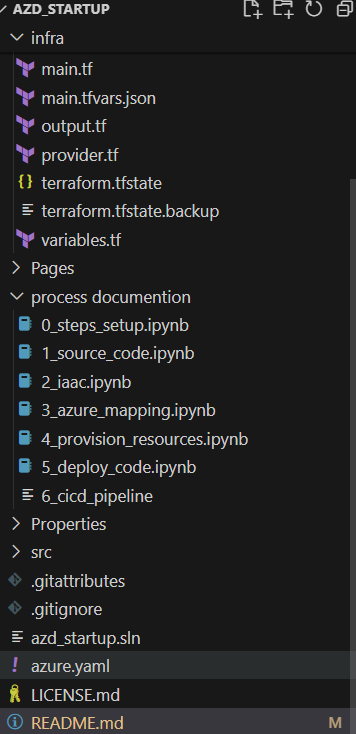

# Azure Developer CLI (azd) Terraform Starter

The project uses Microsoft Learn module on creating a IaaC template with Bicep script and replaces Bicep files with Terraform.

During the process, I corrected code provides by the instructions, as the names of the required arguments became outdated  and there was incorrect syntax in defining tags. 

Please see the notebooks for step by step explanation, commands and images documenting the process.

## 0. Initial set up

## 1. Adding .NET web application source code

## 2. Adding Terraform files 

## 3. Mapping source code to Azure resources

## 4. Provisioning Azure resources

## 5. Deploying source code

## 6. [In progress] Creating CI/CD pipeline
